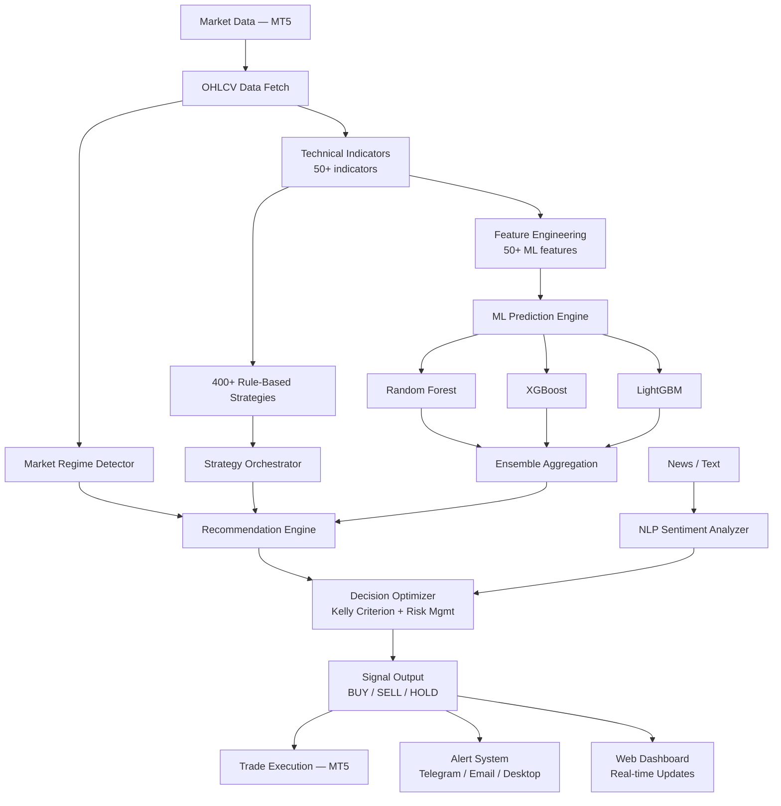

# AI-Powered Algorithmic Trading Platform

[](https://python.org)
[](https://fastapi.tiangolo.com)
[](https://scikit-learn.org)
[](https://xgboost.readthedocs.io)
[](https://tensorflow.org)
[](LICENSE)

---

## Overview

A production-grade **intelligent trading analysis and execution platform** that combines 400+ classical technical strategies with modern machine learning for automated signal generation, market regime detection, and risk-optimized trade execution.

The platform uses an **ML ensemble pipeline** (Random Forest, XGBoost, LightGBM) trained with time-series cross-validation on 50+ engineered features to predict price movements. A recommendation engine personalizes strategy selection based on market regime, while an NLP module extracts sentiment signals from market text. All components feed into a decision optimizer that computes Kelly-criterion position sizing.

Built for **Forex, Crypto, Metals, and Indices** via MetaTrader 5 with a FastAPI backend, real-time WebSocket updates, and a full-featured web frontend.

---

## Key AI Features

- **ML Signal Generation** — Ensemble of Random Forest, XGBoost, and LightGBM classifiers with `TimeSeriesSplit` cross-validation and Optuna hyperparameter optimization
- **Market Regime Detection** — Classifies current conditions (trending up/down, ranging, volatile) using ADX, ATR percentile, and linear regression slope analysis
- **Intelligent Strategy Recommendation** — Performance-weighted scoring with regime affinity, recency decay, and collaborative filtering from user trade history
- **NLP Sentiment Analysis** — Lexicon-based market sentiment extraction from news headlines with entity recognition (symbols, indicators, price levels)
- **AI-Optimized Position Sizing** — Fractional Kelly criterion with volatility adjustment, portfolio risk caps, and correlation-aware exposure management
- **400+ Technical Strategies** — Rule-based strategies (RSI, MACD, Bollinger, Ichimoku, Smart Money, etc.) enhanced by ML confidence overlays
- **Automated Trade Execution** — Dual-server architecture with signal queuing, whitelist filtering, and adaptive risk controls

---

## Architecture



---

## Installation

```bash
# Clone the repository
git clone https://github.com/ARASH3280ARASH/ai-mvp-platform.git
cd ai-mvp-platform

# Create virtual environment
python -m venv venv
source venv/bin/activate  # Windows: venv\Scripts\activate

# Install dependencies
pip install -r requirements.txt
```

---

## Quick Start

### 1. Start the API Server

```bash
python -m uvicorn backend.api.server:app --host 0.0.0.0 --port 8000
```

### 2. Run AI-Enhanced Analysis

```python
from ai_core.pipeline import AIPipeline
from ai_core.config import AIConfig

# Initialize pipeline
pipeline = AIPipeline(config=AIConfig(), account_balance=10_000)

# Train on historical data
pipeline.train(df=ohlcv_data, indicators=indicator_dict, strategy_history=trades_df)

# Run real-time analysis
result = pipeline.analyze(
    symbol="BTCUSD", timeframe="H1",
    df=latest_data, indicators=indicators,
    news_texts=["Bitcoin surges on ETF inflows"],
)

print(f"Signal: {result.ml_signal} | Confidence: {result.ml_confidence:.1%}")
print(f"Regime: {result.regime.regime} | Lot Size: {result.trade_decision.lot_size}")
```

### 3. Start the Trading Bot

```bash
python bot_server.py
```

---

## Project Structure

```
ai-mvp-platform/
├── ai_core/                        # AI / ML pipeline
│   ├── pipeline.py                 # Orchestrates all AI components
│   ├── predictive_model.py         # Ensemble ML signal prediction
│   ├── recommendation_engine.py    # Regime-aware strategy recommendation
│   ├── nlp_processor.py            # Market sentiment analysis
│   ├── decision_optimizer.py       # Kelly-criterion position sizing
│   ├── config.py                   # Model hyperparameters
│   └── utils.py                    # Feature engineering utilities
│
├── backend/                        # FastAPI server
│   ├── api/                        # 35+ REST endpoints + WebSocket
│   │   ├── server.py               # Main application
│   │   ├── database.py             # SQLite (WAL mode)
│   │   ├── alert_manager.py        # Alert CRUD & notifications
│   │   ├── performance_monitor.py  # Account metrics
│   │   ├── risk_engine.py          # Risk calculations
│   │   └── ...
│   ├── strategies/                 # 400+ trading strategies
│   │   ├── orchestrator.py         # Strategy loader & dispatcher
│   │   ├── rsi_strategies.py       # RSI variants
│   │   ├── macd_strategies.py      # MACD variants
│   │   └── ... (20+ category modules)
│   ├── indicators/                 # Technical indicator library
│   └── mt5/                        # MetaTrader 5 integration
│
├── frontend/                       # Web UI (HTML/CSS/JS)
│   ├── dashboard.html              # Main analysis interface
│   ├── alerts_page.html            # Alert management
│   ├── performance.html            # Account performance
│   └── ... (20 pages, full Farsi RTL support)
│
├── bot_server.py                   # Standalone trading bot (port 8001)
├── configs/                        # YAML model configurations
├── notebooks/                      # Research & demo notebooks
├── tests/                          # Test suite
├── models/                         # Trained model artifacts
├── data/sample/                    # Sample datasets
├── requirements.txt
├── pyproject.toml
└── LICENSE
```

---

## AI Pipeline Components

| Component | Module | Description |
|-----------|--------|-------------|
| **Feature Engineering** | `ai_core/utils.py` | 50+ features: price structure, rolling stats, momentum, volume, time encoding |
| **Signal Prediction** | `ai_core/predictive_model.py` | Ensemble of RF, XGBoost, LightGBM with TimeSeriesSplit CV |
| **Regime Detection** | `ai_core/recommendation_engine.py` | ADX + ATR + slope → trending/ranging/volatile classification |
| **Strategy Recommendation** | `ai_core/recommendation_engine.py` | Performance-weighted scoring with regime affinity |
| **Sentiment Analysis** | `ai_core/nlp_processor.py` | Lexicon-based sentiment + entity extraction |
| **Trade Optimization** | `ai_core/decision_optimizer.py` | Fractional Kelly sizing with volatility adjustment |
| **Pipeline Orchestration** | `ai_core/pipeline.py` | Coordinates all components in a single `analyze()` call |

---

## Technologies

| Category | Stack |
|----------|-------|
| **AI / ML** |     |
| **Backend** |     |
| **Data** |     |
| **Trading** |   |
| **Frontend** |    |

---

## Contributing

Contributions are welcome! Please see [CONTRIBUTING.md](CONTRIBUTING.md) for guidelines.

---

## License

This project is licensed under the MIT License — see [LICENSE](LICENSE) for details.
